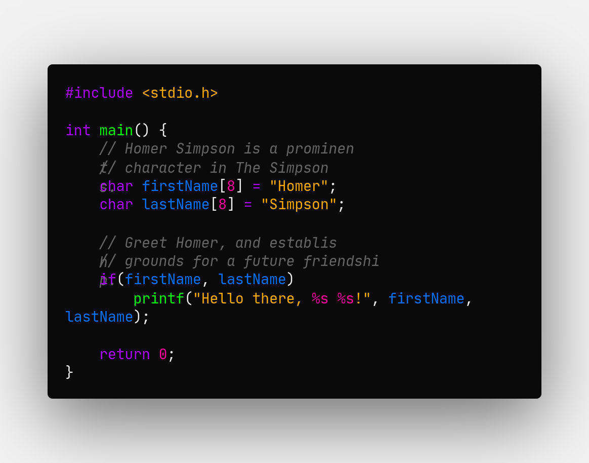
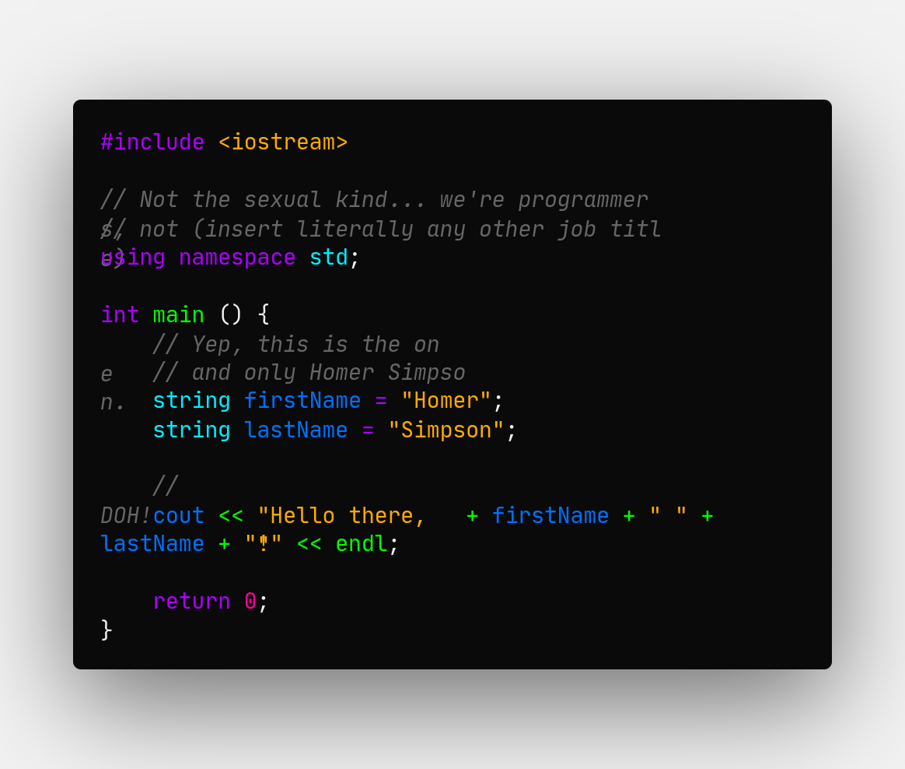
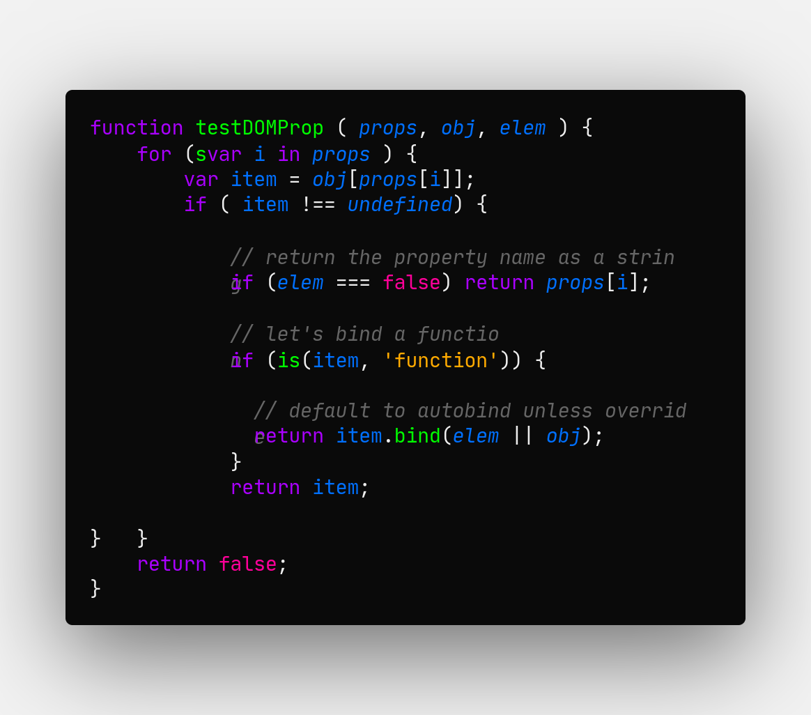
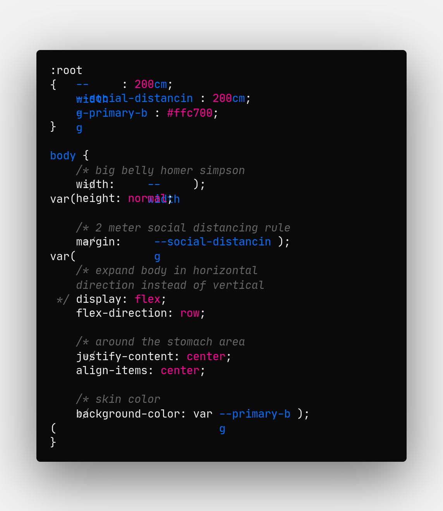

# Nearly Black - Vibrant Dark Theme for Visual Studio Code

Something weird happened to the screenshot utility, some code is wrapped incorrectly and some overlapping.






---

## Installation

### Visual Studio Marketplace

[fssl.nearly-black](https://marketplace.visualstudio.com/items?itemName=fssl.nearly-black)

### Command Palette

Open Command Palette with `CTRL`+`P` and run:

```
ext install fssl.nearly-black
```

### GitHub (Source)

[https://github.com/fredrikstromlarsen/nearly-black](https://github.com/fredrikstromlarsen/nearly-black)

---

## Package the Theme Yourself

### Prerequisites

- git is installed and works properly.
- npm is installed and works properly.
- vsce is installed and configured properly.
- nearly-dark theme is **NOT** on the system.

### Package Time!

```bash
# Clone the Source Code from GitHub
git clone https://github.com/fredrikstromlarsen/nearly-black.git
cd nearly-black

# Package Theme to .vsix File
vsce package
```

Open the folder containing the .vsix file in Visual Studio Code.

1. Right click the theme file in the Explorer tab and click `Install Extension VSIX`. If this option isn't in the menu, install this extension: [fabiospampinato.vscode-install-vsix](https://marketplace.visualstudio.com/items?itemName=fabiospampinato.vscode-install-vsix)

2. Restart Visual Studio Code and hit `CTRL`+`K` then `CTRL`+`T` or go to `File > Preferences > Color Themes`, choose `Nearly Black` from the dropdown.

Need more info? [Check the docs](https://vscode-docs.readthedocs.io/en/stable/extensions/install-extension/).
